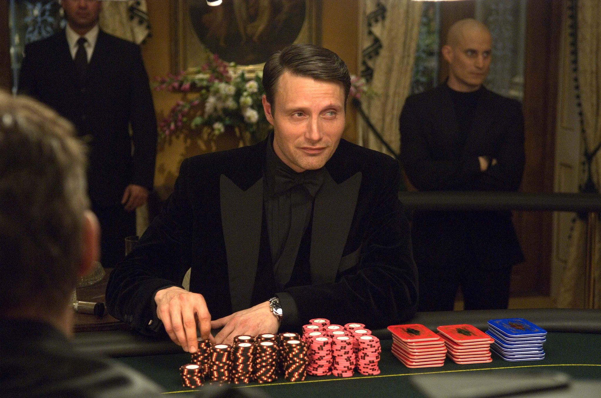
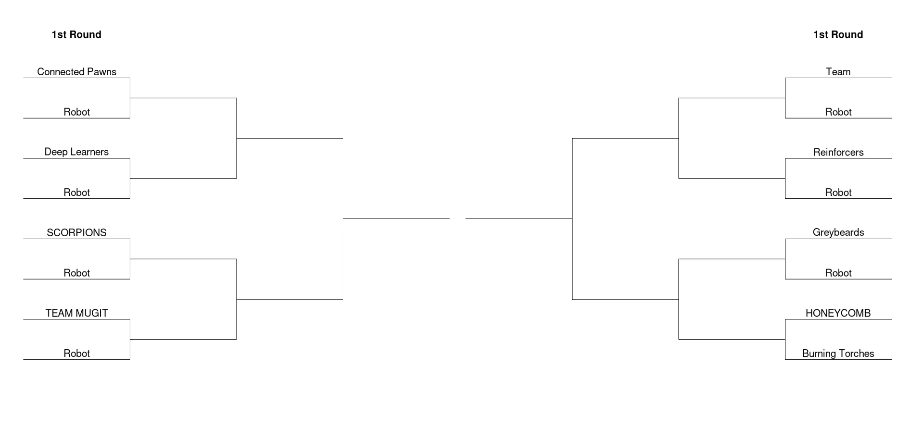

# Poker :slot_machine: :slot_machine: :moneybag::moneybag:

The archetypal imperfect information game and one of the world's most famous card games. Build an AI to win big!

## Rules of Poker

There are many variations of poker. Here we are playing **heads-up limit Texas hold'em** :cowboy_hat_face::cowboy_hat_face:.

**Heads-up**: The game is player 1-on-1 rather than in a group.

**Limit**: There is a fixed bet size that can be placed on each turn. No all-ins here unfortunately!

**Texas Hold'em** :cowboy_hat_face:: Players have two cards in their hand that their opponent cannot see, with up to 5 face-up shared cards.

The rules of poker are a tad involved (though don't worry if you don't understand every detail, your bot will not have to deal a hand :wink:).

[Wikipedia](https://en.wikipedia.org/wiki/Texas_hold_%27em#Rules) has a very good descrition of the rules so we won't rehash it here!

We will be playing with a fixed small and big blind size.

- Small blind = 1 chip
- Big blind = 2 chips

**The goal is to have have more chips that your opponent after all hands have been played**

## Playing against your AI
You can put your AI through its paces by playing against it yourself! Just pass `human_player` as the `your_choose_move` argument to `play_poker()`. You play by entering moves into the command line. It runs in replit though you may need to play with the window size. It is better locally as pygame opens in a new window :window:.

# Competition Rules :scroll:

1. Your task is to build a **Deep Reinforcement Learning agent** that plays Poker.
   - You can only store data to be used in a competition in a dictionary (saved in a `.pt` file by `save_network()`)
   - In the competition, your agent will call the `choose_move()` function in `main.py` to select a move (`choose_move()` may call other functions in `main.py`)
   - Any code **not** in `main.py` **will not be used**.
2. Submission deadline: **5pm UTC, Sunday**.
   - You can update your code after submitting, but **not after the deadline**.
   - Check your submission is valid with `check_submission()`

## Tournament Format :crossed_swords:

Players will play **1 on 1** in a knockout tournament format. As a single hand :hand: of poker is extremely random, each matchup will consist of a large number of hands played.

The winner will be the player with the highest number of chips at the end of all hands.

The competition & discussion will be in [Gather Town](https://app.gather.town/app/nJwquzJjD4TLKcTy/Delta%20Academy) at **6pm UTC on Sunday** (60 mins after submission deadline)!

## Technical Details :hammer:

Our poker environment is based off the [PettingZoo Texas Hold’em environment](https://www.pettingzoo.ml/classic/texas_holdem) so it may be worth reading their documentation.

### States :spades: :hearts: :clubs: :diamonds:

#### Observation

The state of the game is described in a 1-dimensional trinary numpy array of shape **(72,)**. Each element is an interger **0**, **1** or **-1**

The first 52 elements of the state array are mapped to each card in a standard playing card deck. The element is **1** if your player can see the card in their **hand** :hand: and **-1** in the **flop** / **turn** / **river**.

The remaining elements are either **1** or **0** and refer to the chips :fries: that have been bet by your and your opponent in the **4** rounds of betting.

e.g. elements **52 - 56** define whether **0**, **1**, **2**, **3** or **4** chips respectively were bet in the **1st** round of betting.

#### Legal moves

Not all actions are valid on every turn (for example a player cannot **check** after their opponent has **raised**).

The legal moves :oncoming_police_car: avaible to a player is provided on each turn by the **environment** on each turn in the form of an **numpy array** where each element is drawn from the set of possible actions **{0,1,2,3}** (see below).

### Actions :axe:

Your move is defined as an integer

| Action | int |
| ------ | --- |
| Call   | 0   |
| Raise  | 1   |
| Fold   | 2   |
| Check  | 3   |

### Rewards :moneybag:

On turns that are ongoing during a hand, you recieve a reward of `0`
If you win the hand your reward is `+ number of chips won` / 2
If you lose the hand your reward is `- number of chips lost` / 2

## Functions you write :point_left:

<code style="white-space:nowrap;">  train()</code>

Write this to train your network from experience in the environment.
 
 
Return the trained network so it can be saved.

<code style="white-space:nowrap;">  choose_move()</code>

This acts greedily given the state and policy network.
 
 
In the competition, the <code style="white-space:nowrap;">choose_move()</code> function is called to make your next move. Takes the state as input and outputs an action.

## Useful functions :gear:

<code style="white-space:nowrap;">  choose_move_randomly()</code>

Acts randomly  (but legally) given the current state of the game

<code style="white-space:nowrap;">  checkpoint_model()</code>

Save a checkpoint of your model so you can train against it in self-play

<code style="white-space:nowrap;">  ChooseMoveCheckpoint()</code>

Interface to allow the <code style="white-space:nowrap;">opponent_choose_move()</code> function in an environment to be set as a previously saved model checkpoint. The env can be initialised as follows as outlined in our main.py template.

